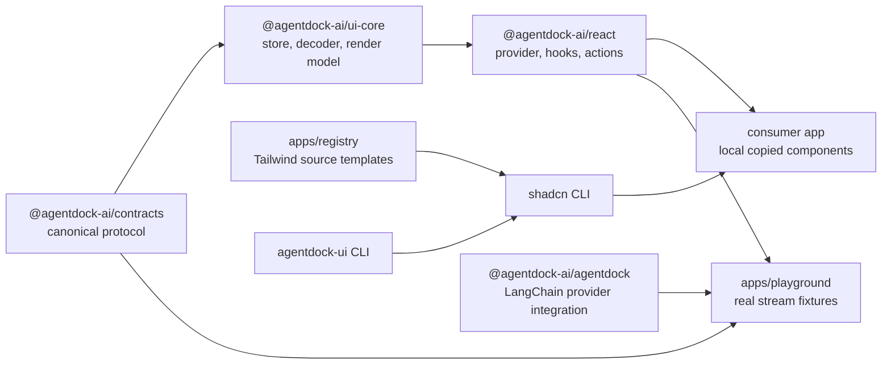

# AgentDock UI V1 architecture and delivery plan

## Purpose

Build AgentDock UI as a small, independent React runtime and a source-copy web
UI system for the AgentDock event protocol. It should have the calm, compact
interaction quality of Assistant UI while retaining AgentDock ownership of the
stream, store, render model, action boundary, and canonical component source.

The workspace migration is complete: `@agentdock-ai/ui-core`,
`@agentdock-ai/react`, and the internal playground now have real boundaries.
The next delivery work is a shadcn-compatible registry. The registry copies
Tailwind component source into the consuming application, where that one local
copy is the UI rendered at runtime. The first user-facing release focuses on a
small set of high-value chat states:

```text
Composer
Message
Streaming text
Thinking indicator
Reasoning
Tool call
Tool timeline
Approval
Error state
```

The plan deliberately excludes thread lists, attachments, voice, branching,
search, generative dashboards, and other advanced product surfaces until the
core stream-to-UI path is stable.

## Architectural decisions

1. AgentDock UI remains independent of Assistant UI.

   Assistant UI is a visual and interaction reference. AgentDock UI does not
   wrap its runtime, depend on its state model, or expose its primitives as
   AgentDock APIs. This prevents a second stream model and keeps AgentDock's
   canonical events as the only source of truth.

2. Keep only real package and application boundaries.

   The completed workspace has `ui-core`, `react`, and `playground`. The next
   real boundaries are the registry application and the thin installation CLI.
   Message, tool, and theme surfaces do not become individual npm packages;
   they are source files installed through the registry.

3. Keep `@agentdock-ai/contracts` external to this repository.

   It is already the protocol shared by AgentDock CLI and backend packages.
   AgentDock UI consumes that contract. It must not create a second copy of
   event types or reducers.

4. Use one visual delivery model: Tailwind source copied by a shadcn registry.

   AgentDock will follow Assistant UI's delivery model. `agentdock-ui init`
   configures shadcn and the AgentDock registry; `agentdock-ui add chat`
   delegates to `shadcn add` and copies editable TSX files into the consumer
   project. The consumer's Tailwind build creates the final CSS.

   V1 will not ship a default styled chat package, a bundled
   `@agentdock-ai/react/styles.css` file, a second `--ad-*` token namespace,
   a React theme object, or a `classNames` map. Consumers style the copied
   source and their normal shadcn/global theme directly.

5. Use Base UI for the copied web component primitives.

   Base UI provides accessible button, textarea, collapsible, dialog, popover,
   tooltip, and menu behavior inside the source-copy component tree. The
   current Radix package components are migration input only; they must not
   become a second permanent visual primitive layer.

6. React components render normalized state only.

   Raw `AgentEvent` objects are decoded, reduced, and projected into a stable
   render model in `@agentdock-ai/ui-core`. Components must not infer tool
   lifecycle or approval state from raw events. Every AgentDock protocol event
   has a deliberate reducer and selector projection before React renders.

## Current-state audit

The current single package already provides a useful base:

- `AgentStore` reduces canonical AgentDock events and retains run history.
- `consumeAgentStream` and `decodeAgentEventStream` consume the transport.
- `AgentProvider` and `useAgentState` bind the store to React.
- `selectRenderMessages` creates a single render-ready message list.
- `Message` renders user, assistant, and tool messages through one path.
- Tool calls have running, completed, failed, and approval statuses.
- Assistant Markdown uses `react-markdown` and `remark-gfm`.
- `AgentChatComposer` supports text, keyboard submit, send, and interrupt.
- The current React package still contains a temporary packaged stylesheet and
  class-name/theme helpers. These are legacy migration input and must be
  retired only after the source-copy registry passes consumer-fixture checks.
- The playground calls a real AgentDock backend with real local sandbox tools.

The current implementation has several gaps that block the intended V1:

| Area | Current behavior | Required V1 behavior |
| --- | --- | --- |
| Render model | Message and tool state exist | Add explicit reasoning, approval, error, timing, and grouped timeline state |
| Streaming text | Text chunks are joined for Markdown | Highlight newly streamed text, keep one assistant message, and show a subtle cursor |
| Thinking state | Generic typing indicator appears for a busy run | Show a shimmer label and optional elapsed time before assistant text arrives |
| Reasoning | Reasoning content falls back to a basic disclosure | Render a dedicated collapsible reasoning panel with streaming and complete modes |
| Single tool | Compact disclosure exists | Add a concise target summary, controlled open state, and consistent status transition |
| Multiple tools | Each tool is rendered independently | Render one timeline summary for a group of calls, with individual expandable details |
| Approval | Selector identifies `tool-approval` | Render decision actions and connect them to a backend resume path |
| Errors | A plain stream error string is shown | Render a compact error surface with safe retry support |
| Scroll | The viewport is a plain overflow container | Follow output near the bottom and offer a return-to-latest control when the user scrolls away |
| Test coverage | Event decoder, selector, stream consumer, and sandbox tests exist | Add fixtures for every V1 visual state and end-to-end real stream scenarios |

## Target workspace

```text
agentdock-ui/
├── package.json                         # private workspace root
├── tsconfig.base.json
├── vitest.workspace.ts
├── yarn.lock
├── packages/
│   ├── ui-core/
│   │   ├── package.json                 # @agentdock-ai/ui-core
│   │   ├── src/
│   │   │   ├── agent-store.ts
│   │   │   ├── consume-agent-stream.ts
│   │   │   ├── decode-agent-event-stream.ts
│   │   │   ├── render-model.ts
│   │   │   ├── select-render-messages.ts
│   │   │   └── index.ts
│   │   └── test/
│   │
│   ├── react/
│   │   ├── package.json                 # @agentdock-ai/react
│   │   ├── src/
│   │   │   ├── agent-provider.tsx
│   │   │   ├── use-agent-state.ts
│   │   │   ├── transport.ts
│   │   │   ├── actions.ts
│   │   │   └── index.ts
│   │   └── test/
│   └── cli/                             # agentdock-ui executable
│       ├── src/commands/init.ts
│       ├── src/commands/add.ts
│       ├── src/registry.ts
│       └── src/index.ts
│
├── apps/
│   ├── registry/                        # AgentDock shadcn registry source/output
│   │   ├── registry/
│   │   │   ├── base/
│   │   │   ├── chat/
│   │   │   ├── message/
│   │   │   ├── composer/
│   │   │   ├── tool-call/
│   │   │   ├── reasoning/
│   │   │   ├── approval/
│   │   │   └── error-state/
│   │   ├── public/r/
│   │   └── scripts/build-registry.ts
│   └── playground/
│       ├── package.json                 # private app
│       ├── src/
│       ├── server/
│       ├── .sandbox/
│       └── vite.config.ts
│
├── scripts/
└── AGENTDOCK_UI_V1_ARCHITECTURE_PLAN.md
```

`@agentdock-ai/ui-core` is named to avoid claiming the broad
`@agentdock-ai/core` package name, which may be useful for the AgentDock
runtime in the future.

### Dependency graph



### `@agentdock-ai/ui-core`

This package contains browser-safe, React-independent code:

- `AgentStore`
- Stream decoding and consumption
- Run retention and event ordering
- Normalized render-model types
- Event-to-render-model selector functions
- Pure formatting helpers for tool summaries and duration values

It depends on `@agentdock-ai/contracts`, but does not depend on React, Radix,
Lucide, Markdown, CSS, or the DOM. This makes it usable by React, a future
React Native package, a CLI preview, or custom application state integrations.

### `@agentdock-ai/react`

This package contains React-specific runtime integration, not a styled chat
library:

- `AgentProvider`, `useAgentStore`, and `useAgentState`
- Typed transport/controller integration for submit, interrupt, approval, and
  retry actions
- Stream lifetime, subscriptions, cleanup, and transport-error state
- React-safe access to the normalized render model from `ui-core`

React is a peer dependency and the package depends on `@agentdock-ai/ui-core`.
The copied visual components import this package for state and actions; the
package does not publish the components' default Tailwind styling.

The target exports are intentionally small:

```text
@agentdock-ai/react
```

The current `components/*`, `styles.css`, theme helpers, `AgentChatView`, and
slot-wide `classNames` APIs are compatibility input during the migration. They
are removed in a documented breaking transition only after the registry path
is complete and validated.

### `agentdock-ui` CLI

The CLI is a thin wrapper around shadcn's registry workflow, not a competing
source-copy implementation. It owns project/package-manager detection,
`components.json` registration, registry URL resolution, and the delegation to
`shadcn@latest init` and `shadcn@latest add`.

It must support `--cwd`, `--yes`, `--overwrite`, and the supported package
manager options. It does not own styling, a visual runtime, provider
configuration, or an event reducer.

### `apps/registry`

The registry holds the canonical AgentDock Tailwind TSX templates. A build step
emits shadcn registry manifests at a stable endpoint such as
`https://r.agentdock.ai/{name}.json`. The registry source is an installation
template only: it is neither imported by `@agentdock-ai/react` nor bundled
into a consumer application.

### `apps/playground`

The playground remains private and is not a component package. It is the
reference implementation and visual regression surface for AgentDock UI.

It owns:

- Provider and model configuration
- Local-storage persistence for playground-only settings
- Real AgentDock stream endpoint
- OpenRouter, OpenAI, and Ollama development configuration
- `.sandbox` file and command tools
- Abort, approval, and retry endpoints used to exercise UI states
- Scenario controls only when a real backend flow cannot generate a state

The playground imports the package through workspace dependencies. It must not
import `../../packages/react/src` directly after the migration. This verifies
the same published entry points that a consumer will use.

## Render-model contract

The core selector converts reducer snapshots and ordered events into messages
that are ready for rendering. The rendering model is an API boundary between
the protocol and React.

```ts
export type RenderMessageState =
  | "streaming"
  | "complete"
  | "stopped"
  | "error";

export interface RenderReasoning {
  text: string;
  state: "streaming" | "complete";
  startedAt?: string;
  completedAt?: string;
}

export interface RenderTool {
  toolCallId: string;
  name: string;
  input: JsonObject;
  progress: readonly ContentPart[];
  output?: JsonValue;
  error?: string;
  status: "running" | "complete" | "failed" | "approval";
  startedAt?: string;
  completedAt?: string;
}

export interface RenderApproval {
  interruptId: string;
  title: string;
  detail: string;
  actions: readonly {
    id: string;
    label: string;
    kind: "approve" | "deny" | "custom";
  }[];
}

export interface RenderError {
  title: string;
  detail: string;
  retryable: boolean;
  scope: "transport" | "run" | "tool";
}

export interface RenderMessage {
  id: string;
  runId: string | null;
  role: "user" | "assistant" | "tool";
  state: RenderMessageState;
  content: readonly ContentPart[];
  reasoning?: RenderReasoning;
  tool?: RenderTool;
  approval?: RenderApproval;
  error?: RenderError;
}

export interface RenderToolTimeline {
  id: string;
  runId: string;
  tools: readonly RenderTool[];
  state: "running" | "complete" | "failed";
}
```

The selector should ultimately project a conversation into ordered turns,
messages, and message blocks. A block may be ordinary content, reasoning, one
tool, a grouped tool timeline, approval, or a scoped error. The exact type
names can evolve during implementation, but these rules must remain true:

1. Every displayed item has a stable ID and one logical position.
2. Assistant text chunks append to a single message.
3. Tool protocol parts never appear again as generic content chips when a tool
   component represents the same call.
4. A tool result, failure, or approval updates the existing tool state rather
   than creating a duplicate visual item.
5. History and live streaming use the same render model and component tree.
6. React receives normalized data, never raw `AgentEvent` objects.
7. A transport error is kept separate from an AgentDock `run.failed` event.
8. Valid media, files, citations, and custom content parts get a typed renderer
   or a safe visible fallback; they are never silently dropped.
9. The canonical contract reducer remains the authority for repeated event IDs,
   fingerprints, logical sequence, and lifecycle validity.

### Event mapping

| AgentDock event | Core responsibility | UI result |
| --- | --- | --- |
| `run.started` | Open the run and establish run/session identity | New turn can show thinking state |
| `message.started` | Create a stable ordered message shell | Assistant stream target exists without an empty duplicate bubble |
| `message.part.delta` text | Append content to the matching message | One assistant message streams in place |
| `message.part.delta` reasoning | Accumulate a reasoning block | Reasoning panel updates in place |
| `message.part.delta` media, file, citation, or custom | Preserve the typed part and its order | Typed renderer or safe content fallback |
| `message.part.delta` tool parts | Preserve canonical protocol data and associate it with the call | No generic duplicate tool chip when ToolCall owns the same call |
| `message.completed` | Mark the message stable and retain final content | Cursor and active treatment stop |
| `tool.called` | Create/update by `toolCallId` and logical order | One compact running tool row |
| `tool.progress` | Append progress to the matching call | Existing row summary/details update |
| `tool.completed` | Attach output and terminal state | Existing row becomes completed; output appears once on expansion |
| `tool.failed` | Attach error and terminal state | Existing row becomes failed with expandable diagnostics |
| `interrupt.required` with `tool-approval` | Retain interrupt metadata and move run to waiting | Approval card appears at the tool location |
| `interrupt.required` with `custom` | Retain custom interrupt metadata | A typed custom-interruption fallback appears in the turn |
| `interrupt.resolved` | Retain decisions and update/clear the active interrupt | Approval shows resolved/pending continuation state |
| `usage.updated` | Update usage without affecting content order | Optional metadata only; transcript remains stable |
| `run.completed` | Complete the run and retain finish/usage/limit data | Final historical view |
| `run.cancelled` | Mark active assistant/tool state stopped | Partial content remains visible |
| `run.failed` | Preserve code, message, and limit data at run scope | One inline run error; retry only if host supports it |
| transport error or malformed frame | Set stream status/error outside the canonical run reducer | One safe transport error; completed history remains intact |

The runtime boundary must process the full stream before any visual component
sees it:

```text
ReadableStream<Uint8Array>
  -> frame buffering and JSON decode
  -> AgentEvent validation with @agentdock-ai/contracts
  -> AgentStore.applyEvent
  -> canonical reduceAgentEvent
  -> normalized render selector
  -> AgentProvider/useAgentState
  -> copied Chat and Message components
```

The event pipeline must also guarantee:

1. `logicalSequence` and canonical event identity prevent duplicate text,
   tools, approvals, and results when a transport frame is replayed.
2. A result with `isError: true` has failed-tool presentation even if it arrives
   through `tool.completed`.
3. Each tool call, approval, and assistant message stays at one stable
   transcript position while its state changes.
4. Cancelled and transport-interrupted streams retain readable partial output.
5. Invalid or incompatible frames fail safely at the transport boundary and
   cannot crash React.
6. Raw events are diagnostic input only; copied React components contain no
   raw-event `switch` statements.

## Copied component architecture

```text
components/agentdock-ui/
├── chat.tsx
├── message.tsx
├── message-content.tsx
├── composer.tsx
├── streaming-text.tsx
├── thinking-indicator.tsx
├── reasoning.tsx
├── tool-call.tsx
├── tool-timeline.tsx
├── approval-card.tsx
└── error-state.tsx

components/ui/
├── button.tsx
├── textarea.tsx
└── collapsible.tsx
```

These are registry templates that shadcn copies into the consumer project. The
consumer owns every file after installation. There is no package-level visual
component tree to configure by `classNames`, theme props, or a stylesheet
import.

`Message` remains the single local rendering component for a normalized
message. Role-specific helpers may exist inside that source tree, but they are
not competing render paths. A message renders content in this order:

```text
assistant text
reasoning panel, when present
tool call or tool timeline, when present
approval card, when required
message-scoped error, when present
```

The selector decides which branch is present. The component only renders it;
it does not decode stream frames or interpret raw events.

### Composer

The V1 composer remains intentionally narrow:

- Auto-sizing textarea
- Enter sends; Shift + Enter inserts a line break
- Send button is disabled only when the application is unavailable or input is
  empty
- Input remains editable while a run is active
- Send button becomes an interrupt button while a run is active
- Proper form semantics, focus treatment, and keyboard accessibility
- Optional controlled mode for host applications that own draft state

Attachments, slash commands, mentions, model selection, dictation, and
context budgeting are separate components after V1. The playground's provider
configuration remains outside the chat composer.

### Streaming text

`StreamingText` receives the fully assembled text content plus a `streaming`
flag. It does not subscribe to the store directly.

- Preserve Markdown structure by assembling adjacent text parts before passing
  them to the Markdown renderer.
- Apply a short color transition to the newest text range only.
- Render a subtle inline cursor while live text is arriving.
- Remove live styling when complete without replacing the message DOM node.
- Respect `prefers-reduced-motion`.

This preserves the current stable chunk assembly while adding the gentle live
feedback seen in Assistant UI.

### Thinking indicator

`ThinkingIndicator` appears only when the run is active and no visible
assistant text or active tool row explains the current state.

It includes:

- A small muted marker or no icon, depending on the selected theme
- A shimmering status label such as `Thinking`, `Planning`, or `Working`
- Optional elapsed time based on `run.startedAt` or local receipt time
- An `aria-live="polite"` status without repeatedly announcing every tick

The existing generic typing indicator is replaced by this state-aware
component.

### Reasoning panel

Reasoning is distinct from assistant answer text.

- Use a controlled collapsible primitive.
- While reasoning streams, keep the panel open by default and pin its preview
  to the newest content unless the reader scrolls upward.
- After completion, collapse to a quiet `Reasoning` label with an optional
  duration.
- Preserve a reader's manual open/close choice for the remainder of the turn.
- Never expose reasoning if the host application filters it from the event
  contract.

### Tool call

The compact resting state should be one line:

```text
› create_file    test.txt                         Completed
```

While active, the status text shimmers. It does not use a large loader.

Expanding the row reveals only the useful diagnostic sections:

```text
Parameters
Progress
Result
Error
```

The row gets its short target summary from primitive input values or explicit
tool metadata. The full structured payload remains available only on expand.

### Tool timeline

The timeline prevents a tool-heavy run from becoming a vertical stack of large
cards.

- Group calls by run and ordered phase.
- Use a compact summary: `Ran 3 tools`, `2/3`, or `1 failed`.
- Expand to show one compact row per tool with name, target, status, and
  duration when available.
- A row can expand independently for parameters and result data.
- A single tool remains a `ToolCall`; two or more related calls become a
  `ToolTimeline`.
- Tool output appears exactly once.

### Approval card

The contract already has `interrupt.required` and `interrupt.resolved`.
The React runtime needs a typed controller action to make those states usable:

```ts
resolveApproval(decision: {
  runId: string;
  interruptId: string;
  decisions: readonly ToolApprovalDecision[];
}): Promise<void>;
```

The card renders title, explanation, input preview, and explicit actions. The
host controller handles the network request; the copied UI source only reflects
pending, accepted, denied, or failed decision state. This is an action boundary
and not a visual configuration object passed to a packaged chat component.

The playground needs a real resume endpoint before approval can be considered
complete. That endpoint and the underlying AgentDock execution API must be
audited before the component is implemented.

### Error state

Errors are scoped and actionable:

- Transport: stream could not be opened or disconnected
- Run: the agent failed before completion
- Tool: one invocation failed, rendered within its tool row

`ErrorState` accepts a title, concise detail, and optional retry callback. A
retry control is only shown for an operation the host can safely repeat. Tool
errors stay with their tool card and do not also appear as a global chat error.

### Chat viewport

The viewport owns scroll behavior:

- Follow live content if the reader is at or near the bottom.
- Preserve scroll position if the reader scrolls up.
- Show a small `Scroll to latest` control when new content arrives below the
  viewport.
- Avoid forced scrolling during expanded tool or reasoning interaction.
- Keep the composer visible and allow typing while an agent is working.

## Visual-system plan

The web UI uses Tailwind in the component source copied to the consumer app.
Tailwind is therefore a V1 requirement for the web registry. We do not also
maintain a compiled CSS version of the same UI.

`agentdock-ui init` uses shadcn initialization to create or respect the host
application's Tailwind setup. The host's existing global stylesheet remains
the only stylesheet entry point. AgentDock does not publish a stylesheet, add
an `--ad-*` namespace, or require a separate visual theme provider.

The copied components use normal shadcn semantic utilities such as:

```text
bg-background             text-foreground
text-muted-foreground     border-border
bg-muted                  bg-primary
text-primary-foreground   ring-ring
```

This gives a host application its own branding automatically. Customization is
intentionally direct:

```text
1. Change normal host shadcn/global theme tokens.
2. Edit a copied AgentDock component's Tailwind classes.
3. Replace a copied local component when behavior must differ.
```

No `theme={{ ... }}` object and no `classNames={{ ... }}` API are added. Those
would recreate the packaged-component model this registry design replaces.

The default component source must be polished before it reaches a consumer:

- Assistant answers are open Markdown text with readable line-height.
- User messages are restrained, right-aligned bubbles.
- Tool and reasoning states are concise disclosures, never a stack of large
  default cards.
- A running tool uses a text shimmer rather than an oversized spinner.
- Tool parameters, progress, result, and error content appear only after
  expansion.
- Multiple related calls form a compact timeline and render every output once.
- Streaming text uses a subtle newest-text treatment and an inline cursor.
- Approval and error actions are explicit, accessible, and scoped to the
  relevant run or tool.
- Focus rings, contrast, spacing, typography, and motion use the host's
  standard semantic tokens.
- All movement has a `prefers-reduced-motion` fallback.

The registry source is the one place AgentDock maintains default visual design;
the consumer's copied file is the one place they change it.

## Delivery transition plan

### Phase 0: preserve the working workspace

The workspace migration is already complete. Before replacing the visual
delivery, record current exports and playground behavior, add fixtures for
message order/tool status/duplicate-free output, and run the existing build,
typecheck, and tests. Existing uncommitted component work must not be lost.

Success condition: the source-copy transition begins from a known working
runtime and real-stream playground.

### Phase 1: complete the framework-independent event projection

- Audit every `AgentEventType` against decoder, reducer state, and selector
  output.
- Extend `ui-core` render state for stopped runs, reasoning, typed content
  fallbacks, grouped tools, approvals, usage, and scoped errors.
- Keep `ui-core` free of React, JSX, Base UI, Tailwind, and DOM dependencies.
- Move/add event and selector tests under `packages/ui-core/test`.

Success condition: a core test decodes a stream, reduces every canonical event,
and produces stable render-ready output without React installed.

### Phase 2: make `@agentdock-ai/react` a headless integration package

- Keep provider, store subscription, and stream lifecycle code in React.
- Define typed controller actions for submit, interrupt, approval resolution,
  and safe retry.
- Remove visual component, stylesheet, theme, and class-map exports only after
  source-copy equivalents are covered by fixtures.
- Keep a short, documented compatibility window if users already consume the
  early package surface.

Success condition: a local copied component can render an AgentDock stream by
importing only runtime hooks and actions from `@agentdock-ai/react`.

### Phase 3: create the Tailwind registry source

- Add `apps/registry` and author the V1 component source there.
- Build Message/Markdown first, then Composer, streaming/thinking, tools and
  timeline, reasoning, approval, and errors.
- Use Base UI plus host shadcn semantic tokens; do not create an AgentDock CSS
  asset or a second theme system.
- Ensure a `chat` registry block resolves each shared local dependency once.

Success condition: the source tree looks polished using only copied Tailwind
components and the host's existing global theme.

### Phase 4: publish registry manifests and add the CLI

- Generate shadcn manifests for `base`, `chat`, and each V1 component.
- Host them at a stable `r.agentdock.ai` endpoint.
- Add `packages/cli`; let it run `shadcn init` and `shadcn add` rather than
  implementing a second copier.
- Test aliases, dependency installation, overwrite protection, and re-runs.

Success condition: `npx agentdock-ui init && npx agentdock-ui add chat` writes
one editable component tree into a clean consumer fixture.

### Phase 5: make the playground a consumer fixture and retire legacy UI

- Use the local registry-style component tree in the playground.
- Keep real OpenRouter/OpenAI/Ollama streams and `.sandbox` tools.
- Add real interruption, approval-resume, and safe retry paths before claiming
  those component states complete.
- Remove `styles.css`, visual Radix code, `AgentChatView`, and visual
  `classNames`/theme APIs only after registry and playground validation pass.

Success condition: exactly one AgentDock chat UI delivery path remains:
Tailwind source copied into the consumer through the registry.

## UI implementation plan

The UI work begins only after `ui-core` owns the normalized render model. Each
slice should be individually reviewable and tested against the real playground.

### Slice 1: render model and message foundation

- Add rendering state for stopped runs, reasoning, approvals, and scoped
  errors.
- Keep `Message` as the only public message renderer.
- Ensure user, assistant, tool, streaming, and historical messages all take
  the same path.
- Add data attributes for role, state, and tool status.

Validation:

- Assistant text chunks update one message.
- Historical messages have the same final appearance.
- Tool output never appears twice.
- Multiple runs retain chronological order.

### Slice 2: streaming text and thinking

- Introduce `StreamingText`.
- Replace generic typing dots with `ThinkingIndicator`.
- Add local timing only where event timestamps are unavailable.
- Add reduced-motion styles.

Validation:

- A stream with no text shows a subtle thinking state.
- New text settles into normal text after streaming.
- Interrupting leaves partial answer text stable.

### Slice 3: reasoning

- Extract reasoning content from generic `MessageContent`.
- Create collapsible reasoning panel state.
- Add streaming preview behavior and completed duration label.

Validation:

- Streaming reasoning follows the newest content.
- A user can collapse or expand it.
- Completed history renders the same content without active animation.

### Slice 4: tool call and timeline

- Finalize the compact `ToolCall` row.
- Build `ToolTimeline` group projection in core.
- Add summary derivation for known primitive input values.
- Add consistent result, error, and timing details.

Validation:

- One tool presents as one compact expandable row.
- Three sequential calls compact into one timeline.
- Progress shimmer stops on completion.
- Error details are visible once and do not duplicate a global error.

### Slice 5: approval and interruption

- Audit the AgentDock backend resume API.
- Add playground endpoints and UI callbacks.
- Implement the approval card and decision-pending state.
- Implement visible stopped-run state for user interruption.

Validation:

- Approval request appears after `interrupt.required`.
- Every decision emits or receives the expected resolution event.
- The run continues, fails, or remains stopped according to backend outcome.

### Slice 6: errors, retry, and scroll behavior

- Replace the current bare error string with `ErrorState`.
- Add retry hooks only where operation semantics are clear.
- Implement the follow-output and scroll-to-latest behavior.

Validation:

- The reader can scroll upward during a stream without being pulled down.
- The latest-output control returns to bottom.
- Retry does not duplicate the submitted user message.

## Testing strategy

### Core tests

Use canonical event fixtures to verify:

- Event decoding and invalid event handling
- Reducer state transitions
- Multi-run ordering
- Assistant chunk assembly
- Tool lifecycle transitions
- Tool grouping and timeline ordering
- Approval projection
- Run cancellation and failure projection
- Deduplication of tool protocol content

### React component tests

Test behavior that cannot be proven in selectors:

- Composer keyboard behavior
- Send and interrupt control states
- Tool and reasoning disclosure semantics
- Approval actions and pending state
- Error retry callback
- Accessible labels and focus behavior
- Reduced-motion classes or behavior where practical

### Playground checks

Run real flows with OpenRouter, OpenAI, or Ollama:

- Ask for a text-only answer
- Create a file
- Read a file
- Update a file
- Run a command
- Trigger a tool failure
- Run multiple tools in one turn
- Interrupt a long-running run
- Exercise approval when the backend resume route is ready

The playground remains a product-quality development surface. It is not a set
of dummy event yields.

## Delivery sequence

Keep source-copy delivery and UX changes in reviewable increments:

1. Complete all-event `ui-core` projection and fixture coverage
2. Define the headless React provider/controller action boundary
3. Build the Tailwind Message and Markdown registry source
4. Add Composer, streaming text, and thinking indicator source
5. Add reasoning, tool call, and tool timeline source
6. Add approval, interruption, error, and scroll behavior source
7. Generate and test shadcn registry manifests
8. Implement the thin `agentdock-ui` CLI wrapper
9. Validate a Vite fixture, a Next.js fixture, and the real playground
10. Retire the legacy packaged CSS/class-map visual layer

Each increment must pass typecheck, package build, relevant unit tests, and a
playground smoke test before the next begins.

## V1 public API target

```tsx
import { AgentProvider } from "@agentdock-ai/react";
import {
  AgentStore,
  consumeAgentStream,
  decodeAgentEventStream,
} from "@agentdock-ai/ui-core";
import { Chat } from "@/components/agentdock-ui/chat";

const store = new AgentStore();

export function AgentPanel() {
  return (
    <AgentProvider store={store} controller={controller}>
      <Chat />
    </AgentProvider>
  );
}
```

The runtime owns state and exposes typed actions. `Chat` is a local source file
created by `agentdock-ui add chat`, not a styled `@agentdock-ai/react` export.
There is no AgentDock stylesheet import, `theme` prop, or `classNames` map.
The exact controller types remain subject to the backend approval/resume audit,
but host network ownership stays explicit. AgentDock UI never stores provider
credentials or makes provider requests by itself.

## Completion criteria

The V1 architecture is complete when:

- The repository is a functioning workspace with `ui-core`, `react`, and
  `playground`, `registry`, and CLI boundaries.
- The only styled chat delivery path is a Tailwind source-copy registry
  installed through shadcn.
- Consumers have a local editable copy of each AgentDock UI component they add;
  no consumer imports an AgentDock stylesheet.
- The React package uses `@agentdock-ai/ui-core` rather than source-relative
  core imports.
- Every canonical `AgentEventType` is decoded, reduced, and intentionally
  projected before React renders it.
- One render model drives live streaming and history, while transport errors
  remain distinct from run errors.
- Text, thinking, reasoning, tools, timelines, approvals, errors, and stopped
  runs have deliberate UI states.
- Real playground flows exercise the same code that consumers import.
- Tool output and status are never duplicated.
- Host shadcn tokens and direct edits to copied source control branding; no
  visual theme object or `classNames` API remains.
- Typecheck, build, unit tests, CLI tests, registry fixture tests, and
  playground smoke checks pass.
